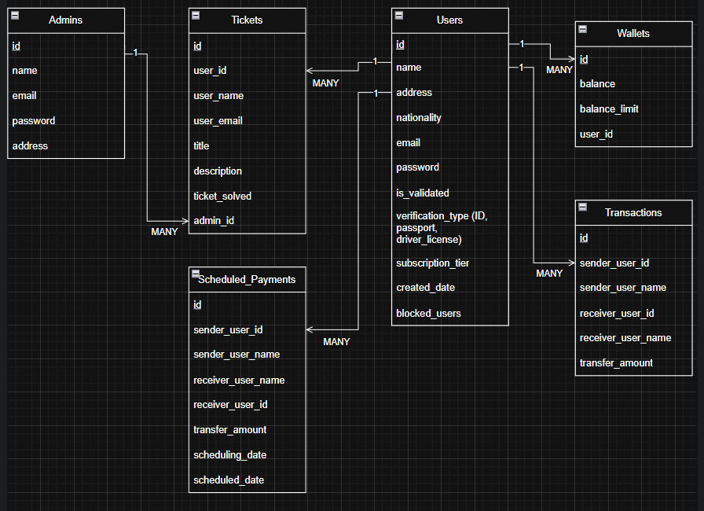
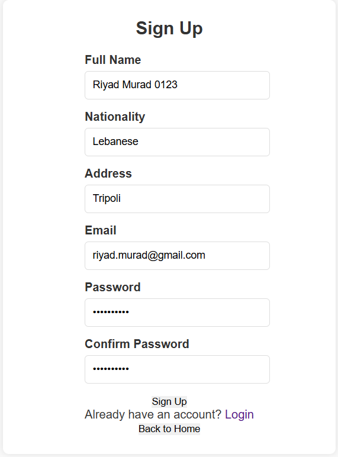
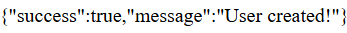

# Digital_Wallet

This project is about a Digital Wallet which allow users to sign up to the platform and use it transfer money from 1 account to another.

- ER Diagram:

</img>

- Documented APIs:

addOrUpdateUser.php:

This API take as a "POST" method 5 inputs which are: "name", "address", "nationality", "email", "password" and as a "GET" method 1 input which is the "id".

If the method is "POST", then the API will take 5 inputs and then create a new user if it is not registered previously.

If the method is "GET", then the API will take 1 input and then return the value of the user with the given id.

As we can see here using the "signup" form, we will fill out some data as shown in the picture below:

</img>

Now after we click on the "signup" button, we will see now that the user was created as shown in the below picture:

</img>

- Public IP Address:

52.47.74.242

-GitHub Pages:

<a href="https://github.com/RiyadMurad44/RiyadMurad44.github.io">The Repository for the GitHub Pages</a>
<a href="https://riyadmurad44.github.io/">https://riyadmurad44.github.io/</a>
