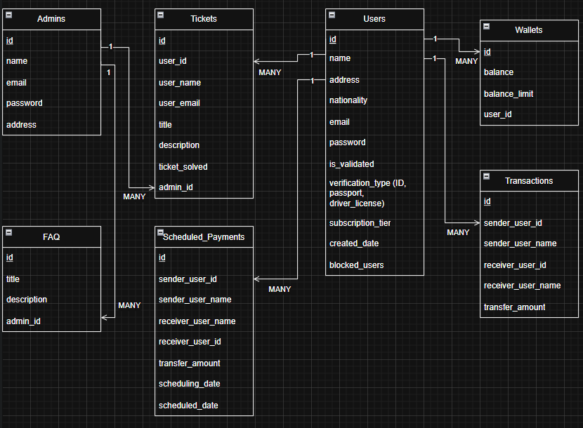

# Digital_Wallet

This project is about a Digital Wallet which allow users to sign up to the platform and use it transfer money from 1 account to another.

In the following Database Diagram, we will see all the tables of this website and explain their connections:

</img>

First, we have the "Users" table which stores the information needed for the user. The user only needs to fill out these fields at first and the rest will be given a default value upon creation:

- Name
- Address
- Nationality
- Email
- Password

The other fields will be given the following attributes by default:

- is_validated = False
- verification_type = NULL
- subscription_tier = 1
- created_date = System Date
- blocked_users = NULL

For the "Wallets" table, a new wallet will be created upon user sign up, but the user also have the privilege to create more than 1 wallet. The default values of the wallet created is as follows:

- id = Auto Incremented
- balance = 0.00
- balance_limit = 20 (Based on subscription tier)
- user_id (will be taken from the user that it is associated to)

For the "Transactions" table, it will only create records when a transaction is commited between 2 users and it will contain the following information:

- sender_user_id    | ID and name of the Sender
- sender_user_name  |
- receiver_user_id  | ID and name of the receiver
- receiver_user_name|
- transfer_amount   | Amount transfered

For the "Scheduled_Payments" table, it will take the same attributes of the "Transaction" table but it will also take the current date that the transaction was issued in and the date that the transaction is scheduled to be sent on.

- scheduling_date: System Date
- scheduled_date: Date 

For the "Tickets" table, the users will be able to submit a ticket for the Admins to view in case they face any issue in accessing any part of the website. The information that the user will need to fill out is the following:

- user_email (it will be filled out if the user is logged into his/her account)
- title 
- description

The remaining of the data will be filled out from the information of the session.

Lastly for the "Admins" table, they are responsible to respond to the tickets issued by users and keep track of users data while also keeping the FAQ section up to date for the users. Admins can only be registered through direct adding to the database.
